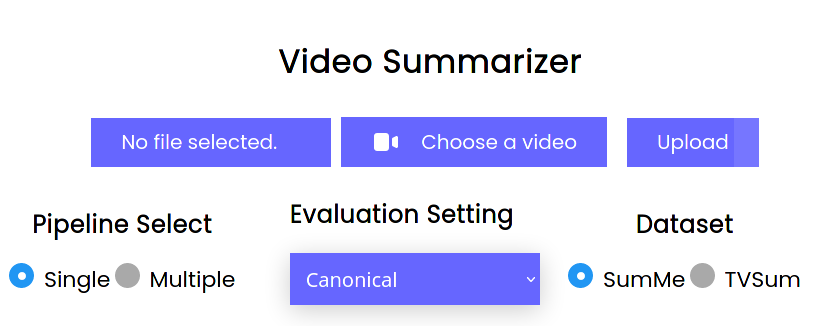

# User Guide

This code is intended to be run on DCS machines, either on an in-person machine or on one of the remote-xx nodes alongside use of a VNC Viewer.

The most common use case for this code will be our web-based video summarisation UI. Here you will be able to chose which of our models to use for video summarisation, as well as the video you want to be summarised.

Some of our pretrained models will come with the code, enough for our video summarisation to function without needing to first train any models.

However, `frontend/backend/pipeline/src/train_notebook.ipynb` can be used to train up/retrain our models on the evaluation settings we mention in our report. Not all pretrained models were uploaded to Github to save space, and because our UI does not use models from all splits. However, the tabula submitted code contains all pretrained models. How to use `train_notebook.ipynb` will be covered in section **"Training models"** of this document. These models can then be used for video summarisation using our web based UI, or our command line based video summarisation.

## Starting the UI

1) Log into a DCS machine or a remote-xx node (with some kind of VNC Viewer).

2) Open a terminal/console.

3) If you are on a **remote-xx node**, ssh into cobra using: `ssh -L5000:localhost:5000 u[yourIDHere]@cobra-01.dcs.warwick.ac.uk`.

This will allow us to run the frontend on cobra, allowing us to use CUDA. We are forwarding port 5000 so that we can view the UI on the remote-xx node, since cobra does not have a GUI. In-person DCS machines have CUDA available, so we do not need to do any of these ssh steps. However you can still run the code in this way if you like, even if you are using an in-person DCS machine.

4) Run `module load cs342-python`.

5) Run `module load cuda11.2`.

If this does not work, then you will have to ssh into cobra, start again from step 3.

6) Navigate to the `frontend/` directory.

7) Run `python3 main.py`.

8) Go to `localhost:5000` in your browser (if you used the ssh steps, do this on the remote-xx node, not on cobra)

## Using the UI

Once you have loaded up the UI, you need to select a video to summarise. You can do this using the "Choose a video" button. Once you have selected the video, click the "Upload" button to have our pipeline start processing your video. Your video will then be displayed to you once this process has been completed.

You can also change the model which is summarising your video by changing the pipeline, evaluation setting, and dataset options on the UI. Below is a screenshot of our UI.

As an example, the default UI options (shown in the image above) will use our single model pipeline that was trained on the SumMe Conical Setting to summarise any videos which are uploaded.

When using the UI, please either use your own videos, or use the example videos in `frontend/backend/pipeline/custom_data/`. The videos in `2FPS_Videos/` **should not** be given as input to our UI as they are downsampled to 2FPS. Our UI works best when given non-downsampled videos, whereas our command line inference code, covered in section "Video Summarisation via the command line" of this guide, can support being given downsampled videos if `--sample-rate` is set to 1. If our UI is given 2FPS videos, the summaries are likely to be very short, since the input video itself is very short.

Note that sometimes the UI state can become de-synced with the application variables. This can occur if you reset the cache of the web page without restarting the application. This can be fixed by either restarting the app or clicking each of the three parameter options at lease once.

## Training models

`frontend/backend/pipeline/src/train_notebook.ipynb` is a notebook file which allows you to interactively train our models. At the top of the notebook there is a "How to use this notebook" section, detailing basic usage of the notebook.

### Opening `train_notebook.ipynb`

To use the notebook, follow the steps below. The steps are very similar to the steps needed to use the UI, except we are using a different port in the case where you are using a remote-xx node.

1) Log into a DCS machine or a remote-xx node (with some kind of VNC Viewer).

2) Open a terminal/console.

3) If you are on a **remote-xx node**, ssh into cobra using: `ssh -L8888:localhost:8888 u[yourIDHere]@cobra-01.dcs.warwick.ac.uk`.

This will allow us to run the notebook code on cobra, allowing us to use CUDA. We can then view the notebook on the remote-node, using our forwarded port, since cobra does not have a GUI. In-person DCS machines have CUDA available, so we do not need to do any of these ssh steps. However you can still run the code in this way if you like, even if you are using an in-person DCS machine.

4) Run `module load cs342-python`.

5) Run `module load cuda11.2`.

If this does not work, then you will have to ssh into cobra, start again from step 3.

6) Navigate to the `frontend/backend/pipeline/src` directory.

7) Run `python3 -m jupyter notebook`

8) In your terminal, you should see two links printed, `http://localhost:8888/?token=... or http://127.0.0.1:8888/?token=...`. Copy and paste of one these links into your browser.

This should open up the standard Jupyter Notebook UI in your browser tab.

If you are using cobra, then you will need to open the browser on the remote-xx node, not cobra.

9) Select and open `train_notebook.ipynb` from the list of files shown.

### Example Notebook Usage

The "How to use this notebook" section of `train_notebook.ipynb` covers how to use the notebook. However as a brief example, say you wanted to train our **multi model pipeline on the TVSum Augmented setting**. To do this, head to the "Train and Evaluate" section of the notebook. This section is organised by dataset, pipeline type and evaluation setting. So first find the "TVSum" subsection. Then within this subsection, find the "Multi Model Pipeline" subsection. Then within this subsection look for the "Augmented" subsection. This running this cell will train, evaluate and save the models for you.

To use this model to summarise a video, you could then start up our UI and select Multiple as the pipeline, Augmented as the setting, and TVSum as the dataset. The model you just trained will then be used for any video summarisations you ask the UI for.

## Usage Tips

If you are having to use cobra, you will notice that model training and UI use requires two different ports that need to forwarded when you log into cobra.

To avoid having to keep logging in and out of cobra, you can do one of the following:

- Log in using `ssh -L8888:localhost:8888 -L5000:localhost:5000 u1803153@cobra-01.dcs.warwick.ac.uk`. This will allow you to forward both the ports that will be used.

- Log into cobra in two terminals, once using `ssh -L8888:localhost:8888 u[yourIDHere]@cobra-01.dcs.warwick.ac.uk` and once using `ssh -L5000:localhost:5000 u[yourIDHere]@cobra-01.dcs.warwick.ac.uk`. You can then run the UI in one terminal, and `train_notebook.ipynb` in the other.

# Other Use Cases

All of these cases require `module load cs342-python` and `module load cuda11.2` to first be run. (which will require being on cobra if working on a remote-xx node, as mentioned in the "Starting the UI" section)

## Extracting Features

While our feature extraction is used in our pipeline, the feature extraction code supports isolated use from the command line, so that features can be extracted for videos passed to it via the command line.

### Features for a single video

1) Navigate to the `frontend/backend` directory.

2) Run/See the example command:

`python3 pipeline/src/extract_features.py feat-anchor-free --ckpt-path pipeline/pretrained_models/pretrain_af_basic/checkpoint/tvsum.yml.0.pt --source ./../../2FPS_Videos/2FPS_TVSum/video/2_fps_EE-bNr36nyA.mp4 --save-path ./dsnet_feature_extraction/features/TVSum --nms-thresh 0.4 --sample-rate 1`

Some explanation about the arguments to this command:

The first argument, in this case passed the value "feat-anchor-free", indicates the model class to load. In this case we want to use our modified DSNet architecture.
`--ckpt-path` should be the relative file path to the DSNet model pretrained weights. Notice that our example command refers to a specific evaluation and split the model was trained on.
`--source` should be the relative file path to the video file.
`--save_path` should be the relative file path to the directory the features are to be saved to
`--sample-rate` refers to how many frames are taken from the video for processing. If your video is already 2FPS, then use a sample-rate of 1, otherwise use a sample-rate of 15 to downsample your input video to 2FPS.

The command given will extract 1024D features by default. You can specify the dimensionality of the features extracted by additionally passing the --featureFormat parameter. This parameter supports "avg1024D" (default) or "avg2D".

For 2D features, you could run:

`python3 pipeline/src/extract_features.py feat-anchor-free --ckpt-path pipeline/pretrained_models/pretrain_af_basic/checkpoint/tvsum.yml.0.pt --source ./../../2FPS_Videos/2FPS_TVSum/video/2_fps_EE-bNr36nyA.mp4 --save-path ./dsnet_feature_extraction/features/TVSum --nms-thresh 0.4 --sample-rate 1 --featureFormat avg2D`

### Features for a batch of videos

Alternatively, this command supports extracting features for a batch of videos via a text file. See the command belows:

#### TVSum (1024D features)
`python3 pipeline/src/extract_features.py feat-anchor-free --ckpt-path pipeline/pretrained_models/pretrain_af_basic/checkpoint/tvsum.yml.0.pt --source ./dsnet_feature_extraction/TVSum.txt --save-path ./dsnet_feature_extraction/features/TVSum --nms-thresh 0.4 --sample-rate 1 --batchExtract True`
#### SumMe (1024D features)
`python3 pipeline/src/extract_features.py feat-anchor-free --ckpt-path pipeline/pretrained_models/pretrain_af_basic/checkpoint/tvsum.yml.0.pt --source ./dsnet_feature_extraction/SumMe.txt --save-path ./dsnet_feature_extraction/features/SumMe --nms-thresh 0.4 --sample-rate 1 --batchExtract True`

#### TVSum (2D features)
`python3 pipeline/src/extract_features.py feat-anchor-free --ckpt-path pipeline/pretrained_models/pretrain_af_basic/checkpoint/tvsum.yml.0.pt --source ./dsnet_feature_extraction/TVSum.txt --save-path ./dsnet_feature_extraction/features/2D/TVSum --nms-thresh 0.4 --sample-rate 1 --batchExtract True --featureFormat avg2D`
#### SumMe (2D features)
`python3 pipeline/src/extract_features.py feat-anchor-free --ckpt-path pipeline/pretrained_models/pretrain_af_basic/checkpoint/tvsum.yml.0.pt --source ./dsnet_feature_extraction/SumMe.txt --save-path ./dsnet_feature_extraction/features/2D/SumMe --nms-thresh 0.4 --sample-rate 1 --batchExtract True --featureFormat avg2D`

The main points to note are the addition of the `--batchExtract True` parameter, as well as the `--source` now being a text file. This text file simply needs to contain a list of relateive file paths to the videos to extract features for.

## Video Summarisation via the command line

Our web-based UI invokes a call to `my_infer.py`, however this can also be invoked via the command line, see below:

1) Navigate to the `frontend/` directory.

2) Run the following command:

`python3 backend/pipeline/src/my_infer.py basic --ckpt-path ./backend/pipeline/models/ab_basic/checkpoint/summe.yml.0.pt --source ./backend/pipeline/custom_data/videos/EE-bNr36nyA.mp4 --save-path ./output.webm --sample-rate 15 --pipeline-mode multi`

Like the UI, this command supports the use of both the single and multi model pipeline, specified via the `--pipeline-mode` parameter (single or multi). You can also specify the evaluation setting the model was trained on by altering the `--ckpt-path` arguement. You can chose from `summe.yml.0.pt`, `summe_aug.yml.0.pt`, `summe_trans.yml.0.pt`, `tvsum.yml.0.pt`, `tvsum_aug.yml.0.pt`, `tvsum_trans.yml.0.pt`. The 0.pt specifies which of the 5 cross validation splits to use, which can take a value from 0 to 4.

## Training Auto Encoders

The training functions in `train_notebook.ipynb` have the option to train auto encoders using the split training data. Alternatively, if you want to use a pretrained auto encoder, then you can retrain the auto encoder already present in the repository. `pipeline/src/ae2d/runAE.py` is a file which will train an auto encoder on a set of precomputed 1024D DSNet features.

1) Navigate to the `frontend/backend/pipeline/src/ae2d` directory.

2) Run `python3 runAE.py`.

## Other Depreciated Functions

We moved our model training and evaluation over to `frontend/backend/pipeline/src/train_notebook.ipynb`. The files `frontend/backend/pipeline/src/train.py` and `frontend/backend/pipeline/src/my_evaluate.py` contain some older code which trains our single model pipeline via the command line. These files still function, but we strongly recommend using our `frontend/backend/pipeline/src/train_notebook.ipynb` notebook instead, since this additionally supports training the multi model pipeline.

Example usage:

1) Navigate to the `frontend/backend/pipeline/src` directory.

2) Run `python3 train.py basic --model-dir ../models/ab_basic --splits ../splits/summe.yml ../splits/tvsum.yml --max-epoch 40`

The first parameter, in this case "basic", specifies which model to train. This function supports our models, "basic" and "gru", as well as DSNet's models, "anchor-based" and "anchor-free". `--splits` specifies the evaluation settings to train on, you can pass any number of these to the function.

`frontend/backend/pipeline/src/evaluate.py` is DSNet's evaluate file, which is invoked when their models are trained.
